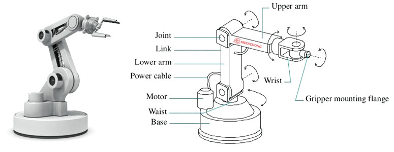
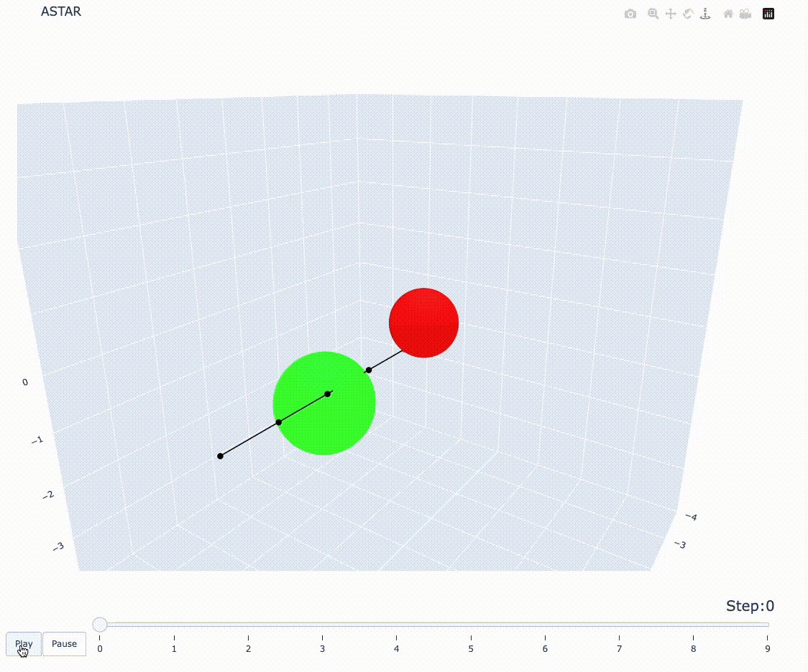
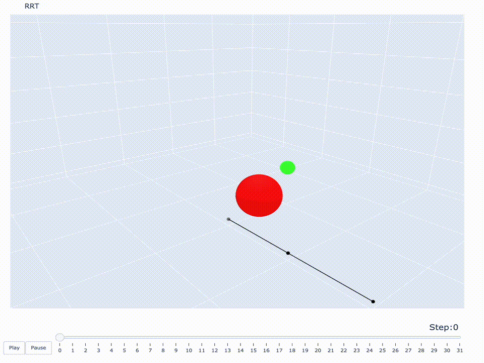
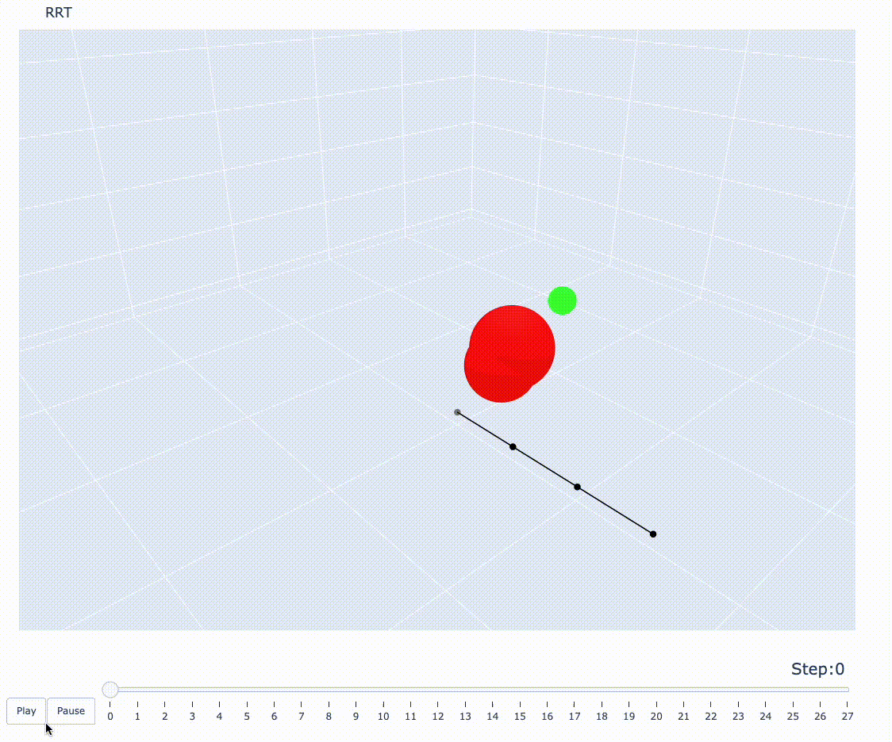
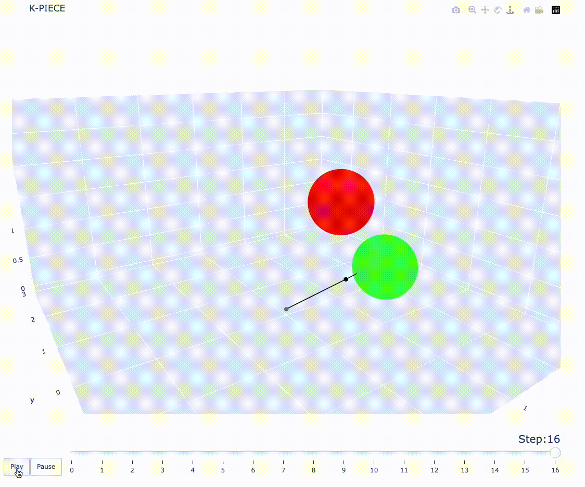

# Manipulator motion planning 

### Description

This repository presents a project on heuristic search on the topic of
motion planning of the manipulator with different degrees of freedom in 3d.

#### Problem Definition

This task could be formally defined as follows: it is required to find sequence of manipulator states that 
init state is $I$, final state is belongs to the set $\mathcal{F}$ and, 
at any time, the projection of the manipulator does not intersect with obstacles from $O$. 

$\mathcal{F}$ is a set such that manipulator state belongs to this set if and only if 
its last joint is close to goal point $G$ (euclid distance is not greater than $\varepsilon$) and 
its projection does not intersect with obstacles. 

$O$ - is a set of obstacles. In our case, there are only sphere obstacles in this set, types of 
different obstacles could be easily extended.

#### Manipulator structure 



While solving the problem, we decided to make the following assumptions:
* each joint is defined by angle - the angle between the arms connected at this joint
* there is an additional degree of freedom that rotates the entire structure parallel to the ground. It is also defined by angle.
* all manipulators arms are in the same plane that is perpendicular to the ground

#### Algorithms

To solve problem we applied following algorithms: 

* $A^*$ [1], baseline algorithm
* $RRT$ [2]
* K-PIECE [3]

### Installation 

We used a bunch of non-standard python libraries, so to install libraries, please, run following 
command: 

```bash
pip install -r requirements.txt
```

The main research is presented [in the notebook `manipulator-milestone2` python notebook](manipulator-milestone2.ipynb).

### Work examples

*gif makes cuts the quality a lot, so it is preferable to check example in html format or in .mov in examples directory*

Work examples are in [examples directory](examples/). 
All visualisations are in HTML format for interactivity; 
the easiest way to view them is to open project in VsCode and `Open with Live Server` HTML file.

In [visualisation notebook](visualisation.ipynb) there is descriptions how visualisation and test generator work with examples. 







### Project Structure

- [Main research](manipulator-milestone2.ipynb) - main notebook

- [Visualisation tutorial](visualisation.ipynb) - notebook with visualisation example

- [Manipulator](manipulator.py) - class that represents manipulator model: 
  - `joint_num`: number of joints of manipulator 
  - `angle_delta`: difference of joint angles in one step
  - `joint_angles`: angles of joints of manipulator 
  - `arm_len`: arms length of manipulator

* [Obstacle](obstacle.py) - interface that represents obstacle. The only function that needs to be implemented for this interface is the functions
that check intersection with given manipulator.

* [Map](map.py) - describes map
    - `obstacles` - list of obstacles on the map 
    - `finish` - goal point 
    - `finish_size` - acceptable error ($\varepsilon$ from Description)

* [Node](node.py) - describes node in heuristic search 

* [astar](astar.py) - $A^*$ algorithm

* [rrt](rrt.py) - $RRT$ algorithm

* [k-piece](kpiece.py) - K-PIECE algorithm
  
* [animate](visualisation.py) - tool for manipulator motion animation 

* [generate_test](test_generator.py) - tool for test generation 


### References

- [1] Peter E. Hart, Bertram Raphael: A Formal Basis for the Heuristic Determination of Minimum Cost Paths [Paper](http://ai.stanford.edu/users/nilsson/OnlinePubs-Nils/PublishedPapers/astar.pdf)
- [2] LaValle, Steven M., Rapidly-exploring random trees: A new tool for path planning. Technical Report. Computer Science Department, Iowa State University  [Paper](http://msl.cs.uiuc.edu/~lavalle/papers/Lav98c.pdf)
- [3] Ioan A. S¸ucan1 and Lydia E. Kavraki: Kinodynamic Motion Planning by Interior-Exterior Cell Exploration [Paper](https://ioan.sucan.ro/files/pubs/wafr2008.pdf)
- [4] Caelan Reed Garrett: Heuristic Search for Manipulation Planning

### Mentor

Yakovlev Konstantin Sergeevich

### Team

* Ivan Volkov 
* Sergey Khargelia
* Daniil Pavlenko 